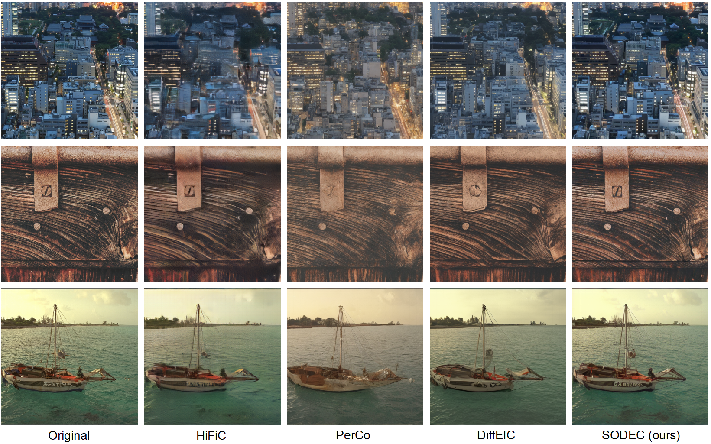
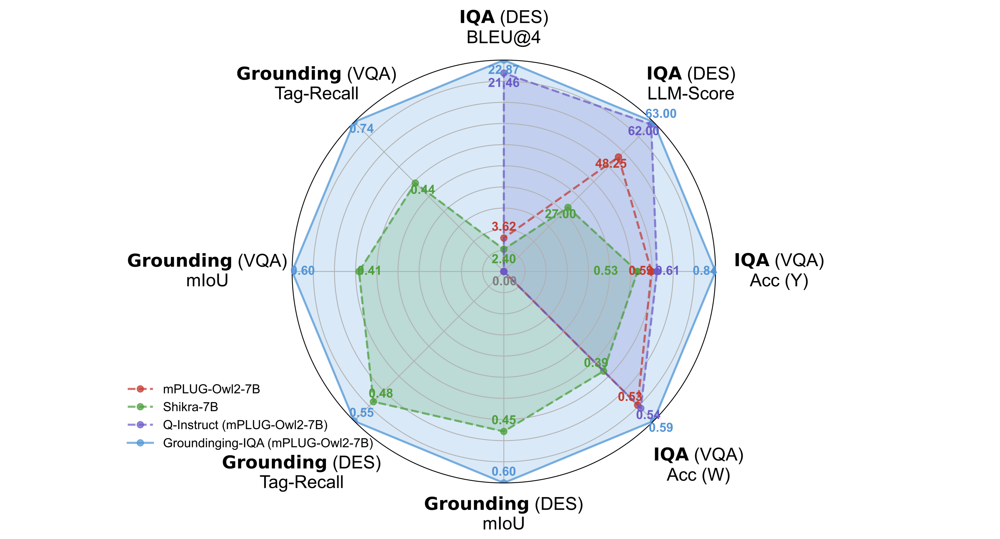
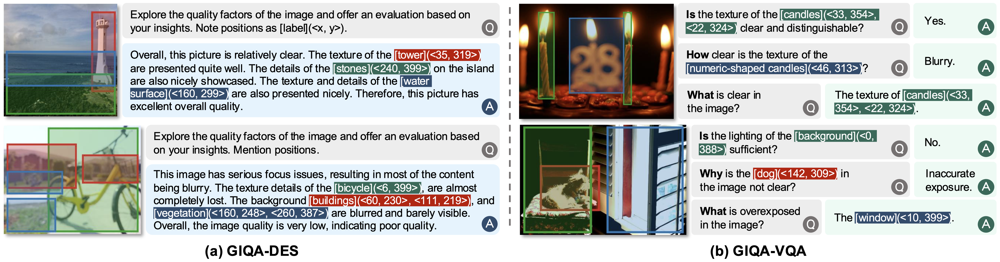
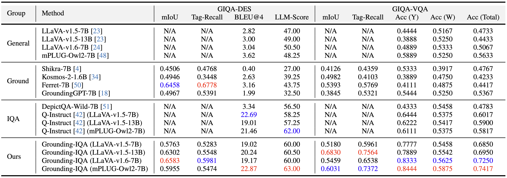
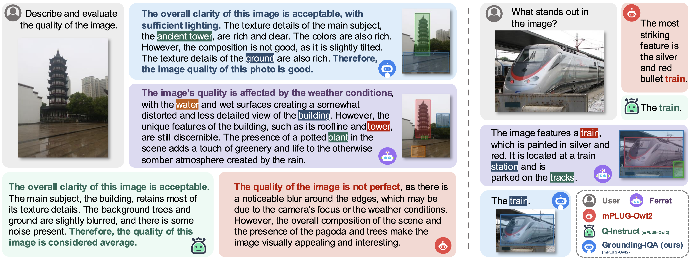

# Grounding-IQA: Multimodal Language Grounding Model for Image Quality Assessment

[Zheng Chen](https://zhengchen1999.github.io/), [Xun Zhang](https://scholar.google.com.hk/citations?hl=zh-CN&user=xCuW6LcAAAAJ), [Wenbo Li](https://fenglinglwb.github.io/), [Renjing Pei](https://orcid.org/0000-0001-7513-6576), [Fenglong Song](https://scholar.google.com/citations?hl=zh-CN&pli=1&user=WYDVk5oAAAAJ), [Xiongkuo Min](https://minxiongkuo.github.io/), [Xiaohong Liu](https://jhc.sjtu.edu.cn/~xiaohongliu/), [Xin Yuan](https://en.westlake.edu.cn/faculty/xin-yuan.html), [Yong Guo](https://www.guoyongcs.com/), and [Yulun Zhang](http://yulunzhang.com/), "Grounding-IQA: Multimodal Language Grounding Model for Image Quality Assessment", 2024

<div>
<a href="https://github.com/zhengchen1999/Grounding-IQA/releases" target='_blank' style="text-decoration: none;"></a>
<a href="https://github.com/zhengchen1999/Grounding-IQA" target='_blank' style="text-decoration: none;"></a>
<a href="https://github.com/zhengchen1999/Grounding-IQA/stargazers" target='_blank' style="text-decoration: none;"></a>
</div>

[[project](https://zhengchen1999.github.io/Grounding-IQA)] [[arXiv](https://arxiv.org/abs/2411.17237)] [[supplementary material](https://github.com/zhengchen1999/Grounding-IQA/releases/download/v1/Supplementary_Material.pdf)] [dataset] [pretrained models]


#### 🔥🔥🔥 News

- **2024-11-26:** This repo is released.

---

> **Abstract:** The development of multimodal large language models (MLLMs) enables the evaluation of image quality through natural language descriptions. This advancement allows for more detailed assessments. However, these MLLM-based IQA methods primarily rely on general contextual descriptions, sometimes limiting fine-grained quality assessment.
> To address this limitation, we introduce a new image quality assessment (IQA) task paradigm, grounding-IQA. This paradigm integrates multimodal referring and grounding with IQA to realize more fine-grained quality perception. Specifically, grounding-IQA comprises two subtasks: grounding-IQA-description (GIQA-DES) and visual question answering (GIQA-VQA). GIQA-DES involves detailed descriptions with precise locations (e.g., bounding boxes), while GIQA-VQA focuses on quality QA for local regions. To realize grounding-IQA, we construct a corresponding dataset, GIQA-160K, through our proposed automated annotation pipeline. Furthermore, we develop a well-designed benchmark, GIQA-Bench. The benchmark comprehensively evaluates the model grounding-IQA performance from three perspectives: description quality, VQA accuracy, and grounding precision. Experiments demonstrate that our proposed task paradigm, dataset, and benchmark facilitate the more fine-grained IQA application.



---

### Pipeline


---

### Radar Chat



## 🔖 TODO

- [ ] Release testing and training code.
- [ ] Release GIQA-160K and GIQA-Bench.
- [ ] Release pre-trained models.
- [ ] Provide WebUI.
- [ ] Provide HuggingFace demo.

## 🔗 Contents

1. [Datasets](#datasets)
1. Models
1. Training
1. Testing
1. [Results](#results)
1. [Acknowledgements](#acknowledgements)

## <a name="datasets"></a>📦 Datasets



## <a name="results"></a>🔎 Results

We achieve impressive performance on GIQA-DES and GIQA-VQA tasks.

<details open>
<summary>Quantitative Results (click to expand)</summary>

- Results in Tab. 5 of the main paper

<p align="center">
  
</p>
</details>

<details open>
<summary>Qualitative Results (click to expand)</summary>

- Results in Fig. 7 of the main paper

<p align="center">
  
</p>
<details>
<summary>More Qualitative Results</summary>


- More Results on GIQA-DES (Fig. 6 of the supplementary material)

<p align="center">
  
</p>

- More Results on GIQA-VQA (Fig. 7 of the supplementary material)

<p align="center">
  
</p>
</details>

</details>

## <a name="citation"></a>📎 Citation

If you find the code helpful in your research or work, please cite the following paper(s).

```
@article{chen2024grounding,
  title={Grounding-IQA: Multimodal Language Grounding Model for Image Quality Assessment},
  author={Chen, Zheng and Zhang, Xun and Li, Wenbo and Pei, Renjing and Song, Fenglong and Min, Xiongkuo and Liu, Xiaohong and Yuan, Xin and Guo, Yong and Zhang, Yulun},
  journal={arXiv preprint arXiv:2411.17237},
  year={2024}
}
```

## <a name="acknowledgements"></a>💡 Acknowledgements

This project is based on [Q-Instruct](https://github.com/Q-Future/Q-Instruct), [DepictQA](https://github.com/XPixelGroup/DepictQA), [mPLUG-Owl](https://github.com/X-PLUG/mPLUG-Owl), and [LLaVA](https://github.com/haotian-liu/LLaVA).

