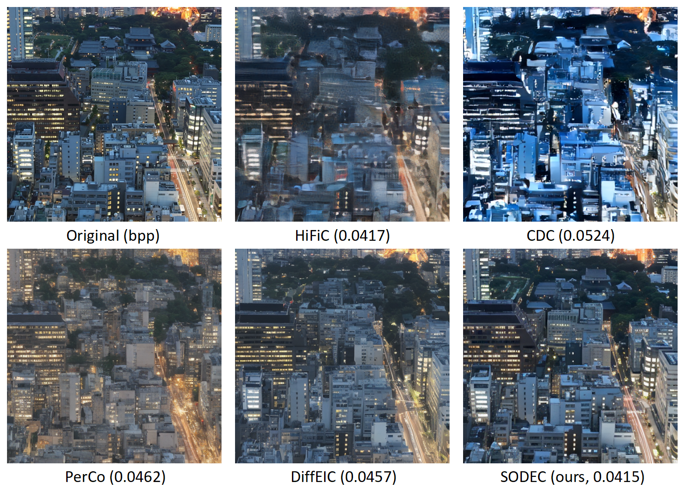
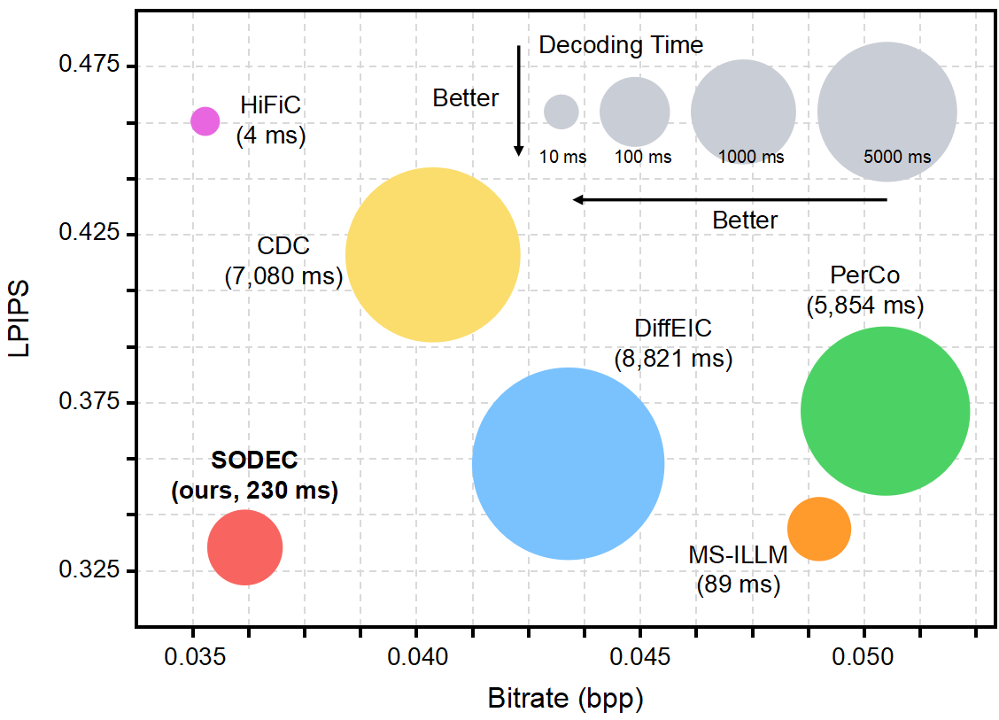
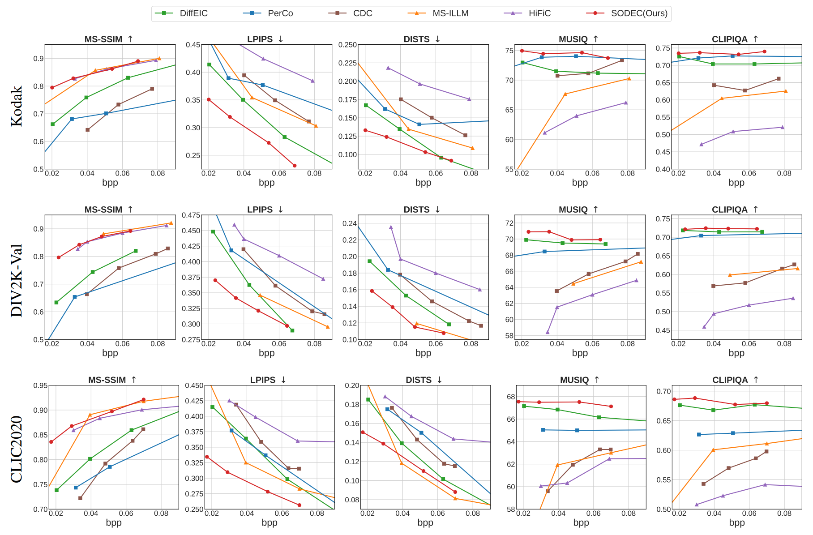
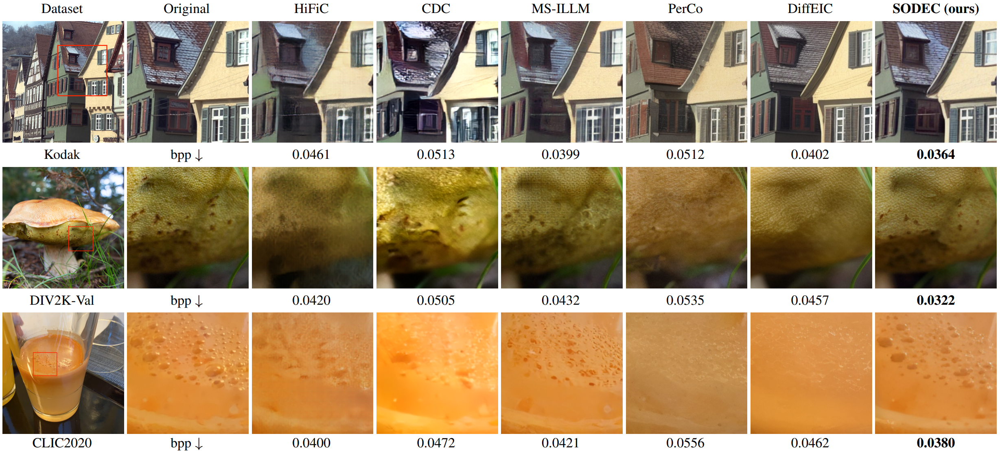

# Steering One-Step Diffusion Model with Fidelity-Rich Decoder for Fast Image Compression
[Zheng Chen](https://zheng-chen.cn), [Mingde Zhou](https://orcid.org/0009-0003-6642-7349), [Jinpei Guo](https://jp-guo.github.io/), [Jiale Yuan](https://www.linkedin.com/in/jiale-yuan-0100a0223/), [Ji Yifei](https://github.com/Niax23), and [Yulun Zhang](http://yulunzhang.com/), "Steering One-Step Diffusion Model with Fidelity-Rich Decoder for Fast Image Compression", 2025

<div>
<a href="https://github.com/zhengchen1999/SODEC/releases" target='_blank' style="text-decoration: none;"></a>
<a href="https://github.com/zhengchen1999/SODEC" target='_blank' style="text-decoration: none;"></a>
<a href="https://github.com/zhengchen1999/SODEC" target='_blank' style="text-decoration: none;"></a>
</div>


[[project](https://zhengchen1999.github.io/SODEC)] [[arXiv]()] [[supplementary material](https://github.com/zhengchen1999/SODEC/releases/download/v1/Supplementary_Material.pdf)] [dataset] [pretrained models]


#### 🔥🔥🔥 News

- **2025-8-07:** This repo is released.

---

> **Abstract:** Diffusion-based image compression has demonstrated impressive perceptual performance. However, it suffers from two critical drawbacks: **(1)** excessive decoding latency due to multi-step sampling, and **(2)** poor fidelity resulting from over-reliance on generative priors. To address these issues, we propose SODEC, a novel single-step diffusion image compression model. We argue that in image compression, a sufficiently informative latent renders multi-step refinement unnecessary. Based on this insight, we leverage a pre-trained VAE-based model to produce latents with rich information, and replace the iterative denoising process with a single-step decoding. Meanwhile, to improve fidelity, we introduce the fidelity guidance module, encouraging outputs that are faithful to the original image. Furthermore, we design the rate annealing training strategy to enable effective training under extremely low bitrates. Extensive experiments show that SODEC significantly outperforms existing methods, achieving superior rate–distortion–perception performance. Moreover, compared to previous diffusion-based compression models, SODEC improves decoding speed by more than 20×.



---

### Pipeline


---

### Performance



## 🔖 TODO

- [ ] Release testing and training code.
- [ ] Release pre-trained models.
- [ ] Provide WebUI.
- [ ] Provide HuggingFace demo.

## 🔗 Contents

1. Datasets
1. Models
1. Training
1. Testing
1. [Results](#results)
1. [Acknowledgements](#acknowledgements)

## <a name="results"></a>🔎 Results

We achieve impressive performance on image compression tasks.

<details open>
<summary>Quantitative Results (click to expand)</summary>

- Results in Fig. 4 of the main paper

<p align="center">
  
</p>
</details>

<details open>
<summary>Qualitative Results (click to expand)</summary>

- Results in Fig. 5 of the main paper

<p align="center">
  
</p>

</details>

## <a name="citation"></a>📎 Citation

If you find the code helpful in your research or work, please cite the following paper(s).

```
@article{chen2025steering,
  title={Steering One-Step Diffusion Model with Fidelity-Rich Decoder for Fast Image Compression},
  author={Chen, Zheng and Zhou, Mingde and Guo, Jinpei and Yuan, Jiale and Ji, Yifei and Zhang, Yulun},
  journal={arXiv preprint arXiv:},
  year={2025}
}
```

## <a name="acknowledgements"></a>💡 Acknowledgements

This project is based on [HiFiC](https://github.com/Justin-Tan/high-fidelity-generative-compression) and [OSEDiff](https://github.com/cswry/OSEDiff).

